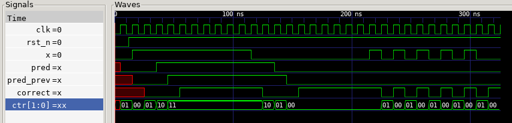

# Adaptive 2-Bit Saturating Counter Predictor (Verilog)
## Overview
This project implements a minimal adaptive hardware predictor using a 2-bit saturating counter FSM. The design uses a reinforcement update rule commonly used in early branch predictors

In this project, we will explore:

* Hardware learning using bounded state
* Convergence behavior under biased input streams
* Limit-cycle behavior under conflicting patterns
* Performance comparison against static prediction baselines

This work is entirely in RTL with a testbench and waveform analysis.

## Architecture
### State Encoding
The predictor maintains 2-bit internal confidence counter:

| State |       Meaning      | Prediction |
| ----- |       -------      | ---------- |
|  00   | Strongly predict 0 |     0      |
|  01   | Weakly predict 0   |     0      |
|  10   | Weakly predict 1   |     1      |
|  11   | Strongly predict 1 |     1      |

Prediction is combinational:
```verilog
assign pred = ctr[1];
```
The MSB is a binary confidence score.

### Update Rule
On each clock edge:

* If `x = 1`, increment counter (unless already 11)
* If `x = 0`, decrement counter (unless already 00)

This is the bounded reinforcement rule:
```code
state(t+1) = saturate(state(t) ± 1)
```
The counter saturates at 00 and 11 to prevent wraparound.

### Why 2 Bits?
A 1-bit counter would flip immediately on a single misprediction.
The 2-bit design introduces hysteresis (lag), requiring two consecutive opposing outcomes to fully reverse prediction direction.

## Behavioral Analysis
### 1. Stationary Bias (All 1s)
* Counter converges to 11
* Prediction accuracy approaches 100%
* Demonstrates rapid reinforcement and stability
### 2. Station
* Counter converges to 00
* Symmetric convergence behavior
* Confirms correct decrement and saturation logic
### 3. Alternating Pattern (101010...)
* Counter oscillates between 01 and 10
* Accuracy ≈ 50%
* Demonstrates inability to capture the relationship between successive positions in a higher order



## Comparison to Static Baselines
The adaptive predictor must be compared against static policies:
* Always predict 0
* Always predict 1

### Observations
* Under stationary bias, static predictors can achieve optimal accuracy.
* Under shifting bias, the adaptive predictor outperforms static policies.
* Under alternating input, both static and adaptive approaches perform near 50% accuracy.

This means:
* Static prediction is a control experiment.
* The performance bound is lower.
* Adaptivity under nonstationary workloads is quantifiable.

## Hardware Cost
The design requires:
* 2 flip-flops
* 2-bit increment/decrement logic
* Simple comparison logic
* Fully synchronous operation

Footprints are small.

## Repository Structure
```code
docs/
  wave.png

rtl/
  predictor.v

sim/
  Makefile

tb/
  tb_predictor.V

README.md
```

## Running Simulation
Assuming iverilog and gtkwave have already been built:
```code
git clone https://github.com/EruditeBoen/adaptive_hardware
cd sim/
make sim
```
# Results
|   Workload   | Adaptive | Static | Last-Value |
|   --------   | -------- | ------ | ---------- |
|  Stationary  |  0.7820  | 0.8120 |   0.6960   |
| Regime Shift |  0.7670  | 0.5000 |   0.6860   |
|  Oscillatory |  0.6000  | 0.5000 |   0.6000   |

## Future Work
* Add a 1-bit predictor comparison
* Extend to 2-level global history predictor
* Add automatic accuracy counters in testbench
* Synthesize and analyze area/timing
* Implement of FPGA
